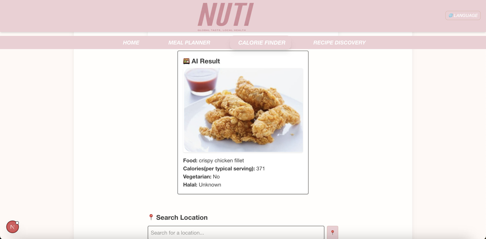

### ON-GOING PERSONAL PROJECT ###

# 🥗 Nuti - AI-Powered Cultural Food Recognition

**Nuti** is a single-page web app (SPA) that helps multicultural Australians identify foods through AI image recognition and discover nearby restaurants or groceries that match their cultural preferences.

---

## 🚀 Features

- 📷 **Camera & Image Upload**: Take a live photo or upload an image of food for analysis.
- 🧠 **AI Recognition**: Uses Google Vision API to detect food labels.
- 🔍 **Nutritional Info**: Fetches calorie and vegetarian info from Spoonacular API.
- 🕌 **Cultural Relevance**: Flags Halal and Vegetarian suitability.
- 📍 **Smart Nearby Places**: Finds related restaurants or stores via Google Maps based on:
    - **User Geolocation:** Automatically detects user's current location.
    - **Custom Location Search:** Allows users to search for places in a specific area with autocomplete suggestions.
    - Results are sorted by distance and link directly to Google Maps.
- 🔄 **Recent Searches History**: Stores and allows re-visiting of past food analysis results, including the image.
- 🥗 **Meal Planner Tool**: Generate a daily meal plan based on cultural preference, with the ability to swap dishes, regenerate, and select your favorites. Each meal (breakfast, lunch, dinner, snack) is visually presented with dish images.
- 📉 **Calorie Finder Tool**: Quickly look up calorie and nutrition info for any food.
- 🖼️ **Download Meal Plan as Image**: Export your selected meal plan as a beautifully formatted, on-brand image (with dish photos) for easy sharing on any platform.
- 📤 **Share UI**: Prominent 'Download as Image' button and social media icons (WhatsApp, X, Facebook, Threads) for easy sharing. Note: Direct image sharing to social media is limited by browser/platform; users can always download and upload the image manually.

### App Screenshots




---

## 🛠️ Tech Stack

- **Frontend**: React + TailwindCSS (Next.js SPA)
- **Image Analysis**: Google Vision API
- **Nutrition Data**: Spoonacular API
- **Maps Integration**: Google Places API (Text Search, Nearby Search, Autocomplete, Details)
- **Firebase**: Firestore for storing cultural food data

---

## 📦 Installation & Setup

To get Nuti up and running on your local machine, follow these steps:

1.  **Clone the repository:**
```bash
git clone https://github.com/JihyeAnnaOh/nuti.git
cd nuti
    ```

2.  **Install dependencies:**
    ```bash
npm install
    ```

3.  **Set up Environment Variables:**
    Nuti requires several API keys to function. Create a file named `.env.local` in the root of the project and add the following:

    ```
    NEXT_PUBLIC_FIREBASE_API_KEY=your_firebase_api_key
    NEXT_PUBLIC_FIREBASE_AUTH_DOMAIN=your_firebase_auth_domain
    NEXT_PUBLIC_FIREBASE_PROJECT_ID=your_firebase_project_id
    NEXT_PUBLIC_FIREBASE_STORAGE_BUCKET=your_firebase_storage_bucket
    NEXT_PUBLIC_FIREBASE_MESSAGING_SENDER_ID=your_firebase_messaging_sender_id
    NEXT_PUBLIC_FIREBASE_APP_ID=your_firebase_app_id
    NEXT_PUBLIC_SPOONACULAR_API_KEY=your_spoonacular_api_key
    NEXT_PUBLIC_GCP_VISION_API_KEY=your_gcp_vision_api_key
    NEXT_PUBLIC_GOOGLE_MAPS_API_KEY=your_google_maps_api_key
    ```
    *Make sure to replace `your_..._api_key` with your actual keys.*
    
    **Important:** For Google Maps, you need to enable the **Places API** and **Maps JavaScript API** in your Google Cloud Console to obtain `NEXT_PUBLIC_GOOGLE_MAPS_API_KEY`.

4.  **Run the development server:**
    ```bash
npm run dev
    ```

5.  **Access the application:**
    Open your browser and navigate to `http://localhost:3000` (or the port indicated in your terminal).

---

## 🥗 Meal Planner & Sharing

- Access the **Meal Planner** from the sidebar.
- Select your cultural preference and choose dishes for each meal.
- Click **Download as Image** to export your meal plan as a shareable image (includes your selected dishes and their photos, styled to match the NUTI brand).
- Share the image on WhatsApp, Facebook, X, Threads, or any platform by uploading the downloaded image.
- Social share buttons provide quick access to share text, but for image sharing, use the download feature.

---

## Will deploy on Vercel. 